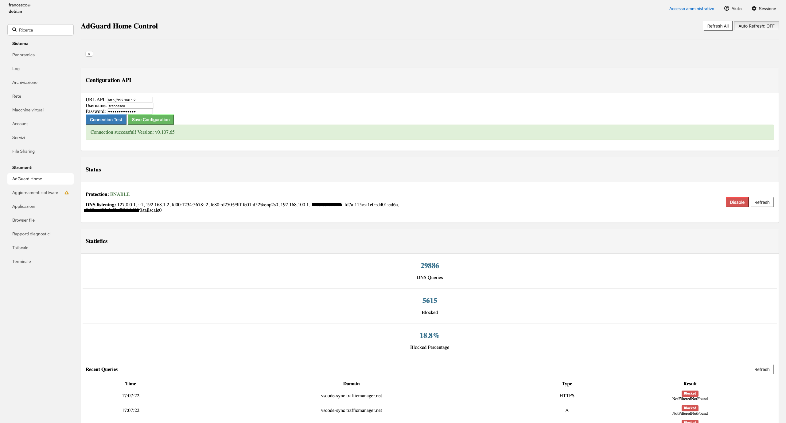

# Cockpit Module for AdGuard Home

[](https://opensource.org/licenses/MIT)

[](https://github.com/francesco-urso/cockpit-adguardhome/releases)

[](https://github.com/francesco-urso/cockpit-adguardhome/issues)

A Cockpit module for managing and monitoring AdGuard Home through its API.



## Installation

### Prerequisites

- Cockpit installed and running
- AdGuard Home installed and accessible
- Node.js and npm (for development)

### Install the module

1. Clone this repository:

```bash
sudo git clone https://github.com/francesco-urso/cockpit-adguardhome.git
```

2. Set proper permissions:

```bash
sudo chown -R root:root /adguard
```

3. Restart Cockpit:

```bash
sudo systemctl restart cockpit
```

4. Access Cockpit web interface and find "AdGuard Home" in the network section.

## Development

### Build from source

1. Install dependencies:

```bash
npm install
```

2. Build the module:

```bash
npm run build-cockpit
```

3. The build module will be in the cockpit-module/ directory.

## Project structure

```text
src/
    modules/
        api.js          # API comunication functions
        status.js       # Status panel component
        statistics.js   # Statistics panel component
        clients.js      # Clients panel component
        filter.js       # Filter panel component
    app.js              # Main applicaztion component
    appHTML.html        # Main application HTML template
    style.css           # Stylesheets
cockpit.config.js       # Build configuration
vite.config.js          # Vite configuration
```

## Contribution

Contributing are welcome! Please feel free to submit a Pull Request

1. Fork the project
2. Create your feature branch (git checkout -b feature/amazin-feature)
3. Commit your changes with the following format: `<GitHub-username> - <branch-type>: <description>`, example:
   - `mario92 - feature: add login page`
   - `giulia-dev - fix: correct typo in navbar`
4. Allowed branch types: `feature`, `fix`, `chore`, `docs`, `refactor`, `test`
5. Push to the branch (`git push origin feature/amazing-feature`)
6. Open a Pull Request

## Troubleshooting

### Common issue

1. Module not showing in Cockpit
   - Check that the module file are in `/usr/share/cockpit/adguard/` ore `/home/<username>/adguard/`
   - Verify file permissions
   - Restart Cockpit service
2. Connection errors
   - Verify AdGuard home is running and accessible
   - Check API credentials in the configuration panel
3. CORS errors
   - Ensure AdGuard Home has the correct CORS setting

## Support

If you encounter anu problems or have question:

1. Check the issues page for existing solutions
2. Creare a new issue whith detailed information about your problem

## License

This project is licensed under MIT License - see the [LICENSE](https://github.com/francesco-urso/cockpit-adguardhome/blob/main/LICENSE).

## Acknowledgements

- AdGuard Home team for the excellent API [AdGuard Home GitHub](https://github.com/AdguardTeam/AdGuardHome?tab=readme-ov-file)
- Cockpit project for the framework [Cockpit Project](https://cockpit-project.org)
- Contributors and testers
